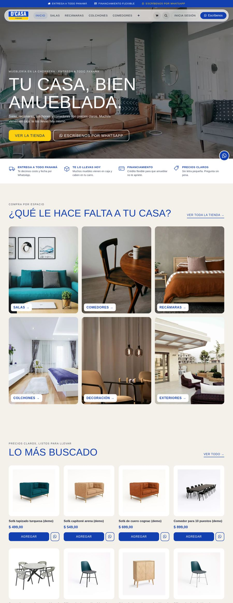
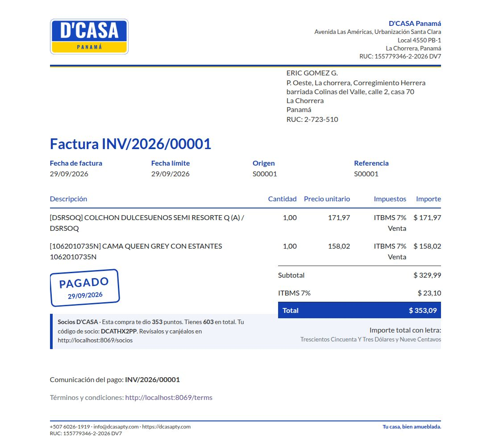
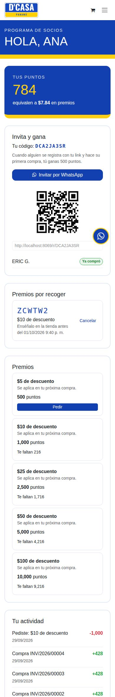

# D'CASA Panamá — ERP + sitio web (Odoo 19 en Cloudflare)

Plataforma única de **D'CASA Panamá** (mueblería en La Chorrera): facturación,
inventario, ventas, compras, CRM, clientes, **sitio web con tienda** y **programa
de puntos y referidos (Socios D'CASA)**, todo sobre el código abierto de **Odoo 19 Community**, con el
código fuente en este repositorio y desplegado en **Cloudflare**.

> Por qué: la tienda dependía de un programador externo y no tenía el código
> fuente. Aquí está todo: Odoo como submódulo (`vendor/odoo`) y las
> personalizaciones de D'CASA como módulos propios (`addons/`). Nunca se toca el
> código de Odoo; se extiende.

## Qué hay

| Carpeta | Qué es |
|---|---|
| `vendor/odoo` | Código fuente de Odoo 19.0 (submódulo git, fijado a un commit). |
| `addons/dcasa_base` | Empresa, Panamá (ITBMS 7 %, plan contable), RUC con DV, USD, apps del ERP. |
| `addons/dcasa_invoice` | Formato de factura D'CASA: marca, RUC+DV, sello **PAGADO**, monto en letras. |
| `addons/dcasa_socios` | Socios D'CASA: puntos automáticos al pagarse la factura, referidos, premios, canjes, cumpleaños y app del socio (celular + PIN) en `/socios`. Reglas de [DCasa-Referidos](https://github.com/abrinay1997-stack/DCasa-Referidos). |
| `addons/website_dcasa` | Sitio web y tienda con la marca, editable desde el constructor de Odoo. |
| `edge/` | Cloudflare Worker + Container que sirve Odoo (caché, seguridad, cron). |
| `docker/` | Imagen de producción (Odoo + módulos) y su arranque. |
| `scripts/test.sh` | Instala los módulos en una base limpia y corre todos los tests. |
| `docs/` | [Plan](docs/PLAN.md) · [Arquitectura](docs/ARQUITECTURA.md) · [Despliegue](docs/DESPLIEGUE.md) · [Socios D'CASA](docs/SOCIOS.md) |

## Empezar (desarrollo local)

Opción A — todo en Docker:

```bash
git clone --recurse-submodules --shallow-submodules <este repo>
docker compose up --build          # http://localhost:8069  usuario admin / admin (solo local)
```

Opción B — Python local (más rápido para desarrollar):

```bash
make setup                         # submódulo + .venv con dependencias de Odoo
make init DB=dcasa                 # crea la base con los módulos y español
make run DB=dcasa                  # http://localhost:8069
make test                          # tests de todos los módulos (necesita PostgreSQL)
make edge-test                     # tests del Worker de Cloudflare
```

`scripts/test.sh` usa `DB_HOST/DB_USER/DB_PASSWORD` (por defecto `localhost/odoo/odoo`).

## Tests y despliegue

Cada push corre en GitHub Actions ([`.github/workflows/ci.yml`](.github/workflows/ci.yml)):

1. **Lint** (ruff + XML).
2. **Tests de Odoo**: instala los 4 módulos (87 tests) en PostgreSQL limpio y corre sus tests
   (la factura de prueba reproduce la factura real INV/2026/00821: $329,99 + ITBMS $23,10 = $353,09).
3. **Tests del borde**: typecheck + vitest del Worker.
4. **Prueba de humo de la imagen**: construye la imagen Docker, la arranca contra una
   base vacía y verifica que el sitio responde.
5. **Despliegue** a Cloudflare, solo en `main` y solo si todo lo anterior pasó.

Pasos para dejar Cloudflare listo: [docs/DESPLIEGUE.md](docs/DESPLIEGUE.md).

## Cómo se edita el sitio (sin programador)

En Odoo: **Sitio web → Editar**. Textos, imágenes, secciones, colores y fuentes se
cambian desde el editor visual. Los productos se publican desde **Inventario /
Ventas → Productos** (casilla *Publicado* y categoría de la tienda). El número de
WhatsApp de todos los botones está en **Sitio web → Configuración → Ajustes**.

## Capturas (base de demostración)

| Inicio | Factura con puntos | App del socio (móvil) |
|---|---|---|
|  |  |  |

> Las fuentes de marca (Anton/Oswald) se cargan desde Google Fonts en producción;
> en las capturas se ve la tipografía de respaldo.
