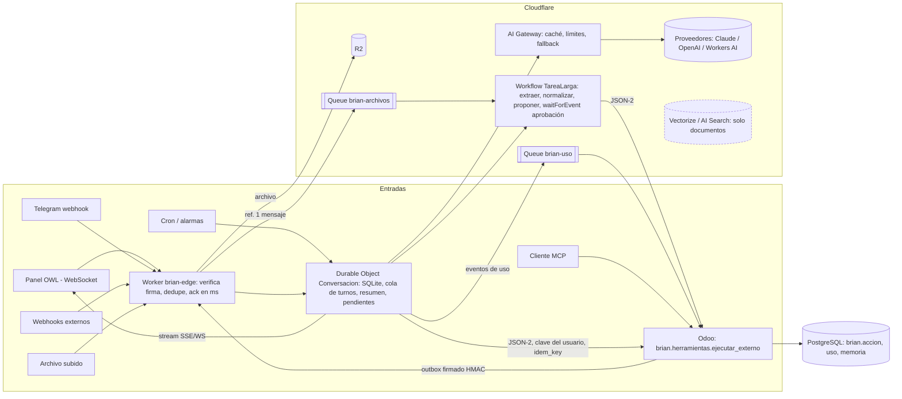

# Brian por eventos: arquitectura, límites y costo (ronda 2)

Agente: `brian-eventos` · Fecha de consulta de todas las fuentes: **2026-09-30** · Solo lectura sobre
`addons/`, `edge/`, `docker/`, `.github/`. Coordinar con `cf-costos` (Containers/Odoo) y `brian-modelos`
(precios de Claude/OpenAI/Muse, caché, batch).

## 0. Resumen ejecutivo

1. **Hoy Brian es un bucle síncrono dentro de una petición HTTP de Odoo** (`conversacion.py:255-300`):
   hasta 8 llamadas al modelo en serie, cada una con timeout de lectura de 120 s y 2 reintentos
   (`proveedores.py:50-51,106-138`), con la transacción de PostgreSQL abierta todo el rato. Peor caso
   teórico ≈ 8 × 3 × (10+120) s ≈ 52 min en una sola petición. El webhook de Telegram espera al modelo
   antes de responder `200` (`controllers/telegram.py:46-51`). No hay cola, ni TTL de acciones, ni memoria
   más allá del hilo, ni streaming.
2. **El costo de la capa de eventos en Cloudflare es casi cero para el volumen de D'CASA.** Con 50, 300 y
   1.500 interacciones/día, todas las dimensiones (Worker, Durable Object, Queues, Workflows, R2) quedan
   dentro de lo incluido en Workers Paid ($5). El primero en agotarse sería la **duración de los Durable
   Objects** (~2.700 interacciones/día con mis supuestos). **La factura real son los tokens del modelo y
   las horas del contenedor de Odoo**, no los eventos (§5).
3. **Recomendación: arquitectura mixta «edge orquesta, Odoo ejecuta y registra»**, introducida por fases y
   con el bucle actual de Odoo **conservado como respaldo** (flag por usuario). Así los tests existentes de
   Brian no se tocan (§7). Odoo sigue siendo sistema de registro (`brian.accion`, política, permisos,
   catálogo de herramientas, MCP); el Worker aporta: ack inmediato, dedupe atómico, un Durable Object por
   conversación, Workflows para tareas largas/aprobaciones, Queue+R2 para archivos, streaming y memoria.
4. **Lo más importante del diseño no es el costo sino la seguridad del puente** Worker↔Odoo: hoy
   `/json/2` no está bloqueado en el borde (`edge/src/routing.ts:12`) y una clave de API por usuario es el
   único mecanismo de identidad real (sin sudo). Ver §6.

## 1. Diagnóstico del acoplamiento actual (con ruta:línea)

Todo lo siguiente corre **dentro del proceso de Odoo** (`docker/entrypoint.sh:42` `workers = 0`: modo
hilos; `limit_time_real` no limita en ese modo, ver B-10 de `brian.md`).

| # | Qué pasa | Evidencia | Consecuencia |
|---|---|---|---|
| 1 | El bucle agéntico (pensar→herramienta→observar) es síncrono, hasta `MAX_PASOS = 8` | `models/conversacion.py:79,255-300` | Un hilo de Odoo ocupado minutos por turno; sin cola |
| 2 | La transacción de BD sigue abierta mientras se espera al modelo: las herramientas escriben (locks de stock/factura) y luego el paso siguiente espera al LLM | `conversacion.py:270-292`; las herramientas corren en `savepoint`, no en commit (`registro.py:203`) | Bloqueos a otros usuarios, fallos de serialización, rollback total si un paso tardío falla (B-11) |
| 3 | Timeouts/reintentos: `TIMEOUT=(10,120)`, `REINTENTOS=2`, backoff hasta 10 s con `time.sleep` | `proveedores.py:50-52,106-138` | `time.sleep` dentro del hilo de Odoo; sin presupuesto global de tiempo (B-10) |
| 4 | Webhook de Telegram síncrono: descarga adjuntos (`_descargar`, timeout 30 s), llama al modelo y envía respuestas antes de devolver `200` | `controllers/telegram.py:31-51`, `models/telegram.py:188-203,403-413` | Si tarda, Telegram puede reintentar (plazo y política de reintento: NO VERIFICADO, `core.telegram.org` bloqueado por el proxy) |
| 5 | Dedupe de reintentos por `update_id <= ultimo_update`, pero el valor se guarda en la **misma transacción** que aún no ha hecho commit | `models/telegram.py:325-327,129` | Un reintento concurrente ve el valor viejo y procesa dos veces (condición de carrera) |
| 6 | Reintentos duplicados del panel: si el cliente se desconecta, Odoo sigue y confirma; el usuario reenvía; `crear_factura` no tiene guarda de duplicado | `conversacion.py:186-211`; B-10 (3) | Acciones duplicadas. Sin idempotencia por `tool_call_id` (ver `brian.md` §4) |
| 7 | Adjuntos: `_extraer_adjuntos` extrae texto **dentro** de `enviar` (síncrono, máx. 20.000 caracteres, 5 MB por imagen) | `conversacion.py:82-83,201,466-500` | Un Excel grande bloquea el turno; no hay pipeline por archivo |
| 8 | Memoria: historial completo por paso y recorte mudo a ~30.000 tokens; sin resumen ni hechos durables; Telegram usa una sola conversación hasta `/nuevo` | `conversacion.py:80,421-439`; B-12 | Se pierden acuerdos del inicio; carga de campos grandes (`crudo`) en cada paso |
| 9 | Estado de acciones pendientes: `brian.accion` en PostgreSQL con estado `por_confirmar`; **sin caducidad** | `registro.py:224-239`, `conversacion.py:213-228`; B-08 | Una tarjeta de hace semanas se confirma con argumentos viejos |
| 10 | Limitadores en memoria del proceso (`_limitar`, `_excede`) | `models/telegram.py:53`, `controllers/mcp.py:79` | Se pierden al reiniciar/dormir el contenedor; no compartidos |
| 11 | Contenedor con `sleepAfter = "30m"` y cron de 10 min que lo mantiene despierto | `edge/src/index.ts:61,97-99`; `infra.md` I-01 | Odoo dormido ⇒ cold start de decenas de segundos (NO VERIFICADO, medir) y Brian, sin forma de degradar, falla |
| 12 | Secretos del modelo y de Telegram se inyectan como variables del contenedor Odoo | `edge/src/index.ts:41-50,65-70`; B-02 (`configuracion()` los devuelve a cualquier usuario interno) | Un RCE/lectura en Odoo filtra la clave del proveedor |
| 13 | No hay medición de costo/tokens (se descarta `uso`) | `proveedores.py:234,300`; B-10 (1) | No hay topes ni tablero |

Lo que **ya está bien** y se conserva: catálogo único de herramientas con nivel (`registro.py`), política
(`politica.py`), auditoría (`accion.py`), confirmación humana y ejecución como el usuario real.
El proveedor `prueba` con guion fijo (`proveedores.py:309-323`) es la pieza que permite probar paridad
entre el bucle de Odoo y el del borde.

## 2. Investigación (fuentes oficiales, consultadas 2026-09-30)

**Nota sobre las fuentes.** `developers.cloudflare.com` está bloqueado por el proxy de este entorno
(`EGRESS_BLOCKED`). Leí las páginas **fuente de la documentación oficial**: el repositorio público
`cloudflare/cloudflare-docs` (rama `production`) vía `raw.githubusercontent.com`, que es el mismo contenido
que publica `developers.cloudflare.com` (cada fila cita la URL pública equivalente). Esas páginas ya
incluyen cambios de julio-septiembre de 2026, lo que confirma que están vigentes. **No** puedo garantizar
que la web pública no haya cambiado en las últimas horas. Tarifas en USD; «incluido» = Workers Paid, por mes.

### 2.1 Precios

| Servicio | Incluido en Workers Paid ($5/mes) | Excedente | URL (oficial) |
|---|---|---|---|
| Workers: solicitudes | 10 M/mes | $0,30 por M | https://developers.cloudflare.com/workers/platform/pricing/ |
| Workers: CPU | 30 M ms/mes | $0,02 por M ms. La duración (wall) no se cobra. No se cobran subsolicitudes | ídem |
| Durable Objects: solicitudes | 1 M/mes (HTTP, RPC, mensajes WebSocket a razón 20:1, alarmas) | $0,15 por M | https://developers.cloudflare.com/durable-objects/platform/pricing/ |
| Durable Objects: duración | 400.000 GB-s/mes (se factura a 128 MB fijos: 0,125 GB/s activo) | $12,50 por M GB-s. Sin cargo si el objeto puede hibernar | ídem |
| DO SQLite: filas leídas / escritas / almacenamiento | 25.000 M / 50 M / 5 GB-mes | $0,001 por M leídas; $1,00 por M escritas; $0,20 por GB-mes | ídem |
| Queues | 1 M operaciones/mes; retención 4 días (config. hasta 14) | $0,40 por M. Operación = cada 64 KB escrito/leído/borrado; entregar 1 mensaje ≈ 3 operaciones; sin cargo de salida | https://developers.cloudflare.com/queues/platform/pricing/ |
| Workflows | Solicitudes y CPU como Workers; 500.000 pasos/mes; 1 GB-mes de estado | $0,80 por 100.000 pasos extra; $0,20 por GB-mes. **Pasos y estado se facturan «a partir del 10-ago-2026 como pronto»** (si ya está activo: NO VERIFICADO) | https://developers.cloudflare.com/workflows/reference/pricing/ y changelog 2026-07-07 |
| R2 (Standard) | 10 GB-mes; 1 M operaciones clase A; 10 M clase B | $0,015 por GB-mes; A $4,50/M; B $0,36/M; salida gratis | https://developers.cloudflare.com/r2/pricing/ |
| Workers KV | 10 M lecturas; 1 M escrituras/borrados/listados; 1 GB | $0,50/M lectura; $5,00/M escritura; $0,50/GB-mes | https://developers.cloudflare.com/kv/platform/pricing/ |
| D1 | 25.000 M filas leídas; 50 M escritas; 5 GB | $0,001/M leídas; $1,00/M escritas; $0,75/GB-mes | https://developers.cloudflare.com/d1/platform/pricing/ |
| Vectorize | 50 M dimensiones consultadas; 10 M almacenadas | $0,01 por M consultadas; $0,05 por 100 M almacenadas | https://developers.cloudflare.com/vectorize/platform/pricing/ |
| AI Search | En beta abierta: **gratis** dentro de límites; Workers AI y AI Gateway se facturan aparte; precio se avisará con ≥30 días | (sin tarifa publicada) | https://developers.cloudflare.com/ai-search/platform/limits-pricing/ |
| Workers AI | 10.000 neuronas/día gratis | $0,011 por 1.000 neuronas; tarifa por token según modelo (§2.3) | https://developers.cloudflare.com/workers-ai/platform/pricing/ |
| AI Gateway | Funciones básicas gratis (analítica, caché, límites de tasa). Registros: clientes nuevos desde 2026-09-24 siguen precio de Workers Logs; antiguos, 10 M logs por gateway. Créditos prepagos (Unified Billing): 5 % de comisión; tarifas del proveedor sin recargo | DLP gratis; Logpush 10 M/mes + $0,05/M | https://developers.cloudflare.com/ai-gateway/reference/pricing/ |
| Workers Logs | 20 M logs/mes | $0,60 por M | https://developers.cloudflare.com/workers/observability/logs/workers-logs/ |
| Cron Triggers | Sin tarifa propia publicada en las páginas leídas; cada ejecución es una invocación del Worker | — | https://developers.cloudflare.com/workers/configuration/cron-triggers/ |
| Containers | 25 GiB-h memoria, 375 vCPU-min, 200 GB-h disco; excedente $0,0000025/GiB-s, $0,000020/vCPU-s, $0,00000007/GB-s. **Fuente: resumen de búsqueda web, no leí la página oficial** (no está en el repo de docs que pude leer) → tratar como NO VERIFICADO; lo cubre `cf-costos` | — | https://developers.cloudflare.com/containers/pricing/ |

### 2.2 Límites relevantes

| Límite | Valor (Workers Paid salvo nota) | URL |
|---|---|---|
| CPU por solicitud HTTP | 30 s por defecto, configurable hasta 5 min (`limits.cpu_ms`). Esperar red/LLM **no** cuenta | https://developers.cloudflare.com/workers/platform/limits/ |
| Duración (wall) | HTTP: sin límite mientras el cliente siga conectado; Cron, alarma de DO y consumidor de Queue: **15 min** | ídem |
| Subsolicitudes | 10.000 por invocación (hasta 10 M configurable); 6 conexiones simultáneas esperando cabeceras | ídem |
| Memoria | 128 MB por isolate | ídem |
| Cron Triggers por cuenta | 250; CPU por cron: 30 s (<1 h de intervalo) / 15 min (≥1 h) | ídem |
| Queues: mensaje | **128 KB** (1 KB = 1000 bytes); lote máx. 100; reintentos hasta 100; retención hasta 14 d; consumidor 15 min de wall y CPU hasta 5 min; retraso máx. 24 h; 5.000 msg/s por cola | https://developers.cloudflare.com/queues/platform/limits/ |
| Workflows | Duración total sin límite mientras cada paso < límite de CPU (30 s, hasta 5 min); resultado de paso 1 MiB; payload de evento 1 MiB; 1 GB de estado por instancia; `step.sleep` hasta 365 d; 10.000 pasos (hasta 25.000); 50.000 instancias **en ejecución** concurrentes (las que esperan no cuentan); creación 300/s por cuenta; reintentos por paso hasta 10.000; retención 30 d; `waitForEvent` por defecto 24 h, entre 1 s y 365 d | https://developers.cloudflare.com/workflows/reference/limits/ y `/workflows/build/events-and-parameters/` |
| Durable Objects (SQLite) | 10 GB por objeto; fila/valor 2 MB; mensaje WebSocket recibido 32 MiB; CPU 30 s renovados por cada solicitud/mensaje (hasta 5 min) | https://developers.cloudflare.com/durable-objects/platform/limits/ |
| Ciclo de vida de un DO | Hiberna tras 10 s de inactividad **solo si** no hay I/O pendiente ni `setTimeout` ni WebSocket estándar; si no, se desaloja a los 70-140 s. Una llamada `fetch` al LLM en vuelo mantiene el objeto en memoria (y facturando duración) | https://developers.cloudflare.com/durable-objects/concepts/durable-object-lifecycle/ |
| WebSocket con hibernación | Las conexiones se mantienen mientras el objeto duerme; sin cargo de duración hibernando; estado por conexión con `serializeAttachment` | https://developers.cloudflare.com/durable-objects/best-practices/websockets/ |
| Agents SDK | 1 GB de estado por agente; 30 s de cómputo renovables por solicitud/mensaje/tarea programada; espera de wall (LLM) ilimitada; decenas de millones de agentes | https://developers.cloudflare.com/agents/platform/limits/ |
| D1 | BD máx. 10 GB; 1.000 consultas por invocación; consulta máx. 30 s | https://developers.cloudflare.com/d1/platform/limits/ |
| Workers AI: tasa | Generación de texto: 300 solicitudes/min por defecto; modelos que exigen plan de pago (Kimi, GLM, DeepSeek V4…): **20/min** (50/min con créditos prepagos de AI Gateway) | https://developers.cloudflare.com/workers-ai/platform/limits/ |
| AI Gateway | Caché: 25 MB por solicitud, TTL hasta 1 mes, **solo solicitudes idénticas**; 10 gateways (Free) / 20 (Paid) | https://developers.cloudflare.com/ai-gateway/reference/limits/ y `/features/caching/` |
| AI Search | Archivo máx. 4 MB; consultas ilimitadas en Paid; 1 M archivos por instancia | https://developers.cloudflare.com/ai-search/platform/limits-pricing/ |

### 2.3 Workers AI: modelos de texto con precio por token (extracto)

Fuente: https://developers.cloudflare.com/workers-ai/platform/pricing/ (2026-09-30).

| Modelo | Entrada / M tokens | Salida / M tokens |
|---|---|---|
| `@cf/meta/llama-3.1-8b-instruct-fp8-fast` | $0,045 | $0,384 |
| `@cf/meta/llama-3.3-70b-instruct-fp8-fast` | $0,293 | $2,253 |
| `@cf/openai/gpt-oss-20b` | $0,200 | $0,300 |
| `@cf/openai/gpt-oss-120b` | $0,350 | $0,750 |
| `@cf/google/gemma-4-26b-a4b-it` | $0,100 | $0,300 |
| `@cf/zai-org/glm-5.3-flash` (plan de pago; caché $0,030) | $0,150 | $0,500 |

Si alguno sirve para **tool calling en español con las ~45 herramientas de Brian** es una pregunta de
evaluación (`brian-evals`/`brian-modelos`): NO VERIFICADO aquí. Claude/OpenAI/Muse Spark pasan por AI
Gateway con llave propia (BYOK; `brian-modelos`).

### 2.4 Agents SDK, McpAgent, Workflows (qué ofrecen)

Fuente: https://developers.cloudflare.com/agents/ (y subpáginas leídas el 2026-09-30).

* `Agent` = un Durable Object con SQL local, estado sincronizado (`setState`), WebSockets, tareas
  programadas (`schedule`/`scheduleEvery`, implementadas con alarmas de DO), webhooks por agente, y
  recuperación de trabajo interrumpido (`runFiber`/`keepAlive`, pensado para el caso «el DO se desaloja a
  mitad de una llamada al LLM»). Documentado como tal: los DO se desalojan por inactividad de 70-140 s, por
  actualizaciones de código (1-2 veces al día) y por timeout de alarma de 15 min.
* Regla oficial: «Agents solos para chat, mensajería y llamadas rápidas. **Agent + Workflow** para tareas
  de más de 30 s, pipelines de varios pasos y flujos de aprobación humana» (`run-workflows`: incluye
  `waitForApproval`, `approveWorkflow`, `rejectWorkflow`).
* `@cloudflare/think`: marco de agente de chat con streaming, memoria persistente, herramientas, tareas
  programadas y «messengers». Es un paquete nuevo: madurez y estabilidad de API NO VERIFICADAS; recomiendo
  **no depender de él** en la primera versión (usar `Agent` + bucle propio).
* Servidor MCP remoto: Streamable HTTP. El endpoint MCP de Brian ya existe en Odoo
  (`controllers/mcp.py`, sin LLM): **se queda en Odoo** (§4.6).
* AI Gateway: fallback entre modelos/proveedores en el endpoint universal, disparado por error o por
  timeout previsto (`cf-aig-step` indica qué proveedor respondió). Fuente:
  https://developers.cloudflare.com/ai-gateway/configuration/fallbacks/

### 2.5 Odoo como ejecutor de herramientas (JSON-2)

Fuente: documentación oficial de Odoo 19, `content/developer/reference/external_api.rst` (repo
`odoo/documentation`, rama 19.0), equivalente a https://www.odoo.com/documentation/19.0/developer/reference/external_api.html
(consultada 2026-09-30):

* `POST /json/2/<modelo>/<método>` con `Authorization: bearer <clave de API>` y `X-Odoo-Database` opcional.
* **«Todas las llamadas corren en su propia transacción SQL; commit si hay éxito, descarte si hay error»**:
  exactamente lo que necesita Brian (cada herramienta = una transacción corta; nada abierto mientras se espera
  al modelo). Consecuencia: no se pueden encadenar llamadas en una transacción, así que la herramienta debe
  ser atómica (ya lo son las de `registro.py`).
* Todas las operaciones se validan con permisos, reglas de registro y acceso a campos **del usuario de la
  clave**. Recomiendan usuarios «bot» dedicados para integraciones automatizadas; para «actuar como la
  persona» la clave es de la persona (con vencimiento; rotación recomendada: generar la nueva antes de
  revocar la vieja).
* El aviso sobre «solo planes Custom» aplica a Odoo Online/SaaS; D'CASA es Community autoalojado (supuesto:
  NO VERIFICADO contra la licencia, pero el código de `/json/2` está en el núcleo).

## 3. Arquitectura propuesta

### 3.1 Principios

1. **Odoo = sistema de registro y ejecutor.** Nada de lógica de negocio en el Worker: el Worker decide
   «qué herramienta llamar», Odoo decide «si se puede y qué pasa».
2. **Identidad real, nunca sudo.** Cada llamada a Odoo lleva la clave de API de la persona (alcance `brian`).
3. **El Worker es desechable.** El estado duradero está en el DO de la conversación (SQLite) y en Odoo
   (`brian.accion`, `brian.uso`, `brian.memoria`).
4. **Todo evento tiene `id` determinista** y todo efecto en Odoo lleva `idem_key`.
5. **Degradar, no fallar:** Odoo dormido y proveedor caído son estados normales.

### 3.2 Diagrama



ASCII (mismo flujo):

```
 Panel(WS) Telegram  Webhook  Archivo  Cron
     \        |        |        |       |
      v       v        v        v       v
   [Worker brian-edge] -- verifica firma/secreto, dedupe(update_id), 200 en <1 s
        |                              \--> R2 (archivo) + Queue(ref) --> Workflow
        v
   [DO Conversacion]  1 por (persona, hilo): cola de turnos, SQLite (mensajes, resumen,
        |              acciones pendientes con TTL, presupuesto de tokens)
        |-- AI Gateway --> Claude / OpenAI / Workers AI   (stream hacia el panel)
        |-- JSON-2 (clave de la persona, idem_key) --> [Odoo] ejecutar_externo / confirmar_externo
        |-- Queue(uso) --> Odoo brian.uso
   [Odoo] -- outbox firmado (HMAC) --> Worker  (p. ej. "factura pagada", "stock bajo")
   [Odoo] -- /brian/mcp (solo herramientas, sin LLM) <-- clientes MCP
```

### 3.3 Componentes y responsabilidades

| Componente | Hace | No hace |
|---|---|---|
| `brian-edge` (Worker) | Autenticar entrada (secreto Telegram, JWT del panel, HMAC de Odoo), dedupe, enrutar al DO, subir archivos a R2, encolar | Llamar al modelo ni a Odoo directamente |
| DO `Conversacion` (SQLite; una instancia por `usuario_odoo:hilo`) | Serializar turnos (una sola cola por conversación ⇒ sin carreras), bucle agéntico, memoria corta, resumen, acciones pendientes y TTL, streaming, presupuesto por persona/día, circuito del proveedor | Persistir la verdad de negocio |
| Workflow `TareaLarga` | Excel/PDF grandes, importaciones, informes programados, reintentos de escrituras en Odoo dormido, espera de aprobación (`waitForEvent`/`waitForApproval`) con timeout = caducidad | Chat interactivo |
| Queue `brian-archivos` | Desacoplar la subida de la extracción; reintentos y DLQ | Transportar el archivo (128 KB máx.; solo **referencia** a R2) |
| Queue `brian-uso` | Llevar `{tokens, costo_est, herramientas, latencia}` a Odoo en lotes | — |
| R2 | Archivos subidos (Excel con imágenes, fotos, PDF) con ciclo de vida (p. ej. borrar a 90 días) | — |
| Odoo | Catálogo, política, ejecución, `brian.accion` (libro), `brian.uso`, `brian.memoria`, MCP | Esperar al modelo |
| AI Gateway | Caché de solicitudes idénticas, límites de tasa, fallback entre proveedores, analítica | — |

### 3.4 Contratos de eventos

Todos los eventos: JSON UTF-8, `schema` versionado, `id` (ULID o hash determinista), `ts` ISO-8601 UTC,
`origen`. Los que entran al Worker desde Odoo llevan cabeceras `X-Brian-Ts`, `X-Brian-Sig`
(`HMAC-SHA256(secreto, ts + "." + cuerpo)`); se rechaza si `|now-ts| > 300 s` o si el `id` ya se vio
(guardado en el DO destino).

| Evento | Productor → consumidor | Campos clave | Clave de idempotencia |
|---|---|---|---|
| `mensaje.recibido` | Panel/Telegram → DO | `canal`, `usuario`, `hilo`, `texto`, `archivos[]{r2_key,sha256,mime,bytes}`, `contexto_pantalla` | `canal:update_id` (Telegram) / `uuid` de cliente (panel) |
| `archivo.subido` | Worker → Queue | `r2_key`, `sha256`, `usuario`, `hilo`, `mime`, `bytes` (≪128 KB) | `sha256` + `usuario` |
| `turno.iniciado/…/terminado` | DO → panel (WS) | `turno_id`, `delta` (texto en streaming), `herramienta`, `estado`, `uso` | `turno_id` |
| `accion.propuesta` | DO ← Odoo | `accion_id`, `resumen` ya resuelto, `hash_args`, `expira` | `accion_id` |
| `accion.decidida` | Panel/Telegram → DO | `accion_id`, `decision` (confirmar/rechazar), `hash_args`, `por` | `accion_id` (una sola decisión) |
| `odoo.evento` | Odoo → Worker | `tipo` (`factura.pagada`, `stock.bajo`…), `modelo`, `res_id`, `usuario_destino` | `id` de `brian.evento` |
| `programado.disparo` | Cron/alarma → Workflow | `regla`, `ventana` | `regla:ventana` |
| `uso.turno` | DO → Queue → Odoo | `modelo`, `tok_in`, `tok_out`, `tok_cache`, `costo_est`, `herramientas[]`, `ms` | `turno_id` |

### 3.5 Idempotencia y concurrencia

* **Dedupe de entrada**: en el DO, `update_id`/uuid en SQLite con `INSERT OR IGNORE`: un solo hilo de
  ejecución por DO lo hace atómico (arregla la carrera de `models/telegram.py:325-327`).
* **Herramientas**: `idem_key = "{conversacion}:{turno}:{tool_call_id}"`; Odoo la guarda en `brian.accion`
  (restricción única con `models.Constraint`, convención de `CLAUDE.md`) y si ya existe devuelve el
  resultado previo **sin ejecutar** (arregla la duplicación de `crear_factura`).
* **Workflows**: `id` de instancia determinista (p. ej. `tarea-<sha256>`). Reintento de pasos con backoff;
  pasos de escritura siempre con `idem_key`.
* **Orden**: mensajes de una conversación se procesan en serie; uno nuevo mientras hay turno en curso se
  encola o cancela el turno (botón Detener), decisión de producto.

### 3.6 Confirmación humana asíncrona

1. El DO llama `ejecutar_externo`; si la herramienta es sensible Odoo responde `por_confirmar` con
   `accion_id`, `resumen` (resuelto, B-09), `hash_args` y `expira` (TTL: 30 min chat/Telegram; 24 h MCP;
   B-08).
2. El DO **suspende el turno** (estado en SQLite; no consume nada) y avisa por el canal de origen y, si la
   persona tiene Telegram vinculado, también por Telegram (botones existentes).
3. La decisión llega como `accion.decidida`. El Worker verifica que el `callback` viene del `chat_id`
   vinculado; el DO llama `confirmar_externo(accion_id, hash_args)` con la **clave de esa persona**; Odoo
   rechaza si caducó, si cambió el hash o si el dueño no coincide.
4. Tareas largas (Workflow): `waitForEvent("decision-<accion_id>", timeout = TTL)`; al vencer → `caducada`.
   Las instancias en espera no cuentan para los 50.000 concurrentes y no consumen CPU.
5. MCP sigue sin ejecutar sensibles (se conserva).

### 3.7 Memoria

| Capa | Dónde | Contenido | Política |
|---|---|---|---|
| Corto plazo | SQLite del DO | Últimos N mensajes + resultados de herramientas recortados | Consulta acotada (no cargar `crudo`) |
| Resumen | SQLite del DO (+ copia en Odoo al cerrar) | Resumen incremental cuando se supera el presupuesto; se inyecta como primer mensaje etiquetado «dato» | Lo genera un modelo barato; nunca borra sin resumir (arregla B-12) |
| Hechos durables | Odoo `brian.memoria` (clave, valor, alcance persona/empresa), espejo en el DO | Preferencias («factúrame a nombre de ACME») | Opt-in, visible y editable; el admin puede revisarla (B-12 d) |
| Documentos | R2 + (Vectorize o AI Search) | Manuales, catálogos, Excel normalizados | Solo si hay caso real de recuperación; con pocos documentos basta buscar en Odoo |

Vectorize/AI Search **no son necesarios al inicio**: los datos de negocio se recuperan con las
herramientas de Odoo (búsqueda exacta, cifras calculadas por Odoo). Decisión basada en costo/complejidad;
evaluar en `brian-evals` si un caso (p. ej. preguntas sobre manuales de proveedores) lo justifica.

### 3.8 Streaming

El DO reenvía el flujo SSE del proveedor como mensajes WebSocket al panel (hibernación para las
conexiones ociosas). El panel OWL actual usa RPC no-streaming (`brian.md` B-10 (4), B-23); el cambio es
frontal y se hace en la fase 5. Si el navegador no puede abrir WebSocket → *fallback* a polling del
estado del turno (`GET /brian/turno/<id>`).

### 3.9 Observabilidad de costo, tokens y acciones

* Cada turno emite `uso.turno` (§3.4): tokens de entrada/salida/caché, costo estimado con la tarifa del
  modelo (tabla versionada en Odoo), herramientas llamadas y latencias. Se guarda en `brian.uso` (Odoo),
  consultable por persona/día/modelo, con **topes** (por persona/día y global) aplicados en el DO.
* `brian.accion` sigue siendo el libro de acciones (añadir `canal`, `turno_id`, `idem_key`, `modelo`).
* Workers Logs (20 M logs incluidos) con un `console.log` JSON por evento; AI Gateway para la analítica del
  proveedor. Límite de gasto de CPU por Worker con `limits.cpu_ms` (recomendación oficial contra
  «denial-of-wallet»).
* Alerta: si `costo_dia > umbral` → mensaje a Telegram del administrador.

### 3.10 Degradación

| Falla | Detección | Comportamiento |
|---|---|---|
| Odoo dormido (cold start del contenedor) | Timeout corto (p. ej. 5 s) en la primera llamada; la primera `fetch` ya lo despierta | Responder «estoy despertando el sistema, dame un minuto»; lecturas: reintento con backoff; **escrituras**: pasan a un Workflow con reintentos e `idem_key`; el turno sigue cuando Odoo responde. Conversación sin herramientas (charla, redacción) sigue funcionando |
| Odoo caído/error 5xx | Circuito abierto tras N fallos | Mensaje claro; eventos de Odoo→Worker se reencolan; nada se pierde (Queue retiene 4 días) |
| Proveedor de IA 429/5xx/timeout | Respuesta de error o `cf-aig-step` | Fallback por AI Gateway (verificado) a segundo proveedor/modelo; si falla, mensaje en español y estado «reintentar» sin perder el turno |
| Presupuesto agotado | Contador en el DO | Modelo barato o «solo lectura» hasta mañana |
| DO desalojado a mitad de turno | Reinicio del DO | `runFiber`/estado persistido: el turno se reanuda o se marca `interrumpido` (no se repite ninguna herramienta gracias a `idem_key`) |

## 4. Alternativas comparadas

| Criterio | A. Brian en Odoo endurecido (sin cola) | B. Brian en Odoo con cola y workers dedicados | C. Brian en el borde (Odoo solo ejecuta) | **D. Mixta (recomendada)** |
|---|---|---|---|---|
| Qué es | Mantener el bucle; deadline por turno, idempotencia, transacciones cortas, `brian.uso` | Tabla `brian.trabajo` + `ir.cron`/hilo dedicado; polling o `bus.bus` para respuesta | Todo el bucle en Worker/DO; Odoo por JSON-2 | Borde para entrada, estado, streaming, archivos y tareas; Odoo para ejecución y libro; bucle Odoo como respaldo |
| Bloqueo de hilos de Odoo | Sí (1 hilo por turno) | No en HTTP, pero un hilo de cron (hoy `max_cron_threads = 1`, `entrypoint.sh:43`) queda ocupado minutos; más hilos = más RAM en el contenedor | No | No (salvo respaldo) |
| Contenedor dormido | Brian no responde nada | Igual | Responde y degrada | Responde y degrada |
| Costo extra en Cloudflare | $0 | Posible 2.º contenedor o más RAM (`cf-costos`) | ≈ $0 (§5) | ≈ $0 (§5) |
| Complejidad nueva | Baja | Media | Alta (reescribir bucle y adaptadores en TS) | Media, por fases |
| Riesgo de seguridad | El actual | El actual | Nuevo: clave por persona fuera de Odoo | Igual que C, acotado |
| Streaming / WebSocket | Difícil (hilos) | `bus.bus` (desvío) | Natural (DO) | Natural |
| Paridad con tests existentes | Total | Alta | Hay que reescribir | Total (Odoo intacto) |
| Reversibilidad | — | Media | Baja | Alta (flag) |

Veredicto: A es obligatorio de todas formas (arregla B-08, B-10, B-11 en Odoo y es el respaldo); B no
elimina la dependencia del contenedor despierto ni el costo por hilo; C pura duplica trabajo; **D** da los
beneficios de C con la red de seguridad de A.

## 5. Costo mensual de la capa de eventos

### 5.1 Supuestos explícitos (por interacción = 1 mensaje de la persona → respuesta)

* 3 llamadas al modelo y 3 llamadas a herramientas de Odoo; 4.000 tokens de entrada y 300 de salida por
  llamada (con preselección de ~12 herramientas y sin caché: conservador).
* Solicitudes al Worker: 3 (entrada, decisiones, eventos). CPU del Worker: 25 ms en total.
* Solicitudes al DO: 4. Filas escritas en SQLite: 15; leídas: 300.
* DO activo: 25 s de turno + 10 s antes de hibernar = 35 s ⇒ **5 GB-s** (redondeado al alza; 0,125 GB × 35 s = 4,4).
* 20 % con archivo (R2: 0,2 escrituras y 0,4 lecturas por interacción; 2 MB por archivo); 0,3 mensajes de
  Queue (≈ 1 operación); 10 % lanza un Workflow de 6 pasos (0,6 pasos).
* 5 logs por interacción; cron cada 5 min (8.640 invocaciones/mes).
* Mes = 30 días; 50 / 300 / 1.500 interacciones por día = 1.500 / 9.000 / 45.000 al mes.

### 5.2 Consumo frente a lo incluido

| Dimensión (incluido) | 50/día | 300/día | 1.500/día |
|---|---|---|---|
| Solicitudes Worker (10 M) | 13.000 | 36.000 | 144.000 |
| CPU Worker (30 M ms) | 37.500 | 225.000 | 1.125.000 |
| Solicitudes DO (1 M) | 6.000 | 36.000 | 180.000 |
| **Duración DO GB-s (400.000)** | 7.500 | 45.000 | **225.000 (56 %)** |
| Filas escritas DO (50 M) | 22.500 | 135.000 | 675.000 |
| Filas leídas DO (25.000 M) | 450.000 | 2,7 M | 13,5 M |
| Operaciones Queues (1 M) | 1.500 | 9.000 | 45.000 |
| Pasos Workflows (500.000) | 900 | 5.400 | 27.000 |
| R2 clase A / B (1 M / 10 M) | 300 / 600 | 1.800 / 3.600 | 9.000 / 18.000 |
| R2 almacenamiento acumulado/mes (10 GB) | 0,6 GB | 3,6 GB | 18 GB (+$0,12) |
| Logs (20 M) | 7.500 | 45.000 | 225.000 |
| **Excedente total sobre el plan** | **$0** | **$0** | **≈ $0,12** (R2) |

Punto de saturación: 400.000 GB-s / 5 GB-s = 80.000 interacciones/mes ≈ **2.700/día**.
Sensibilidad (peor caso): si el DO espera 10 × más (50 s de razonamiento por llamada ⇒ ~50 GB-s por
interacción), a 1.500/día serían 2,25 M GB-s ⇒ (2,25 M − 0,4 M) → $12,50 × 2 (redondeo por M) ≈ **$25**.
Mitigación: las esperas largas (modelos de razonamiento, Excel grandes) van en **pasos de Workflow**, que
no facturan CPU mientras esperan la red (página de precios de Workflows), y el DO solo recibe el resultado.
R2: con 12 meses sin purga a 1.500/día serían ~216 GB ⇒ ≈ $3/mes; usar regla de ciclo de vida.

**Conclusión: la capa de eventos cabe en los $5 del plan** (que el contenedor ya exige: Containers
requiere Workers Paid, fuente secundaria). Costo marginal de pasar Brian al borde: **≈ $0**.

### 5.3 Lo que sí cuesta: tokens (ilustración con Workers AI, tarifa oficial §2.3)

Por interacción: 12.000 tokens de entrada + 900 de salida.

| Modelo | Neuronas/interacción | 50/día | 300/día | 1.500/día |
|---|---|---|---|---|
| `llama-3.1-8b-instruct-fp8-fast` (81 neuronas; $0,0009) | 81 | $0 (4.040/día < 10.000 gratis) | ≈ $4,70/mes | ≈ $36,70/mes |
| `gpt-oss-120b` (443 neuronas; $0,0049) | 443 | ≈ $4,00/mes | ≈ $40,60/mes | ≈ $216/mes |

(Cálculo: `(neuronas/día − 10.000) × 30 × $0,011/1.000`.) Los precios de Claude/OpenAI/Muse Spark los
cubre `brian-modelos`; el orden de magnitud es el mismo: **el modelo es el costo dominante**, por lo que
preselección de herramientas, caché de prompt, modelo pequeño para lectura y topes por persona importan más
que cualquier decisión de infraestructura. Calidad de tool calling de estos modelos: NO VERIFICADO.

### 5.4 Fuera de este informe (Odoo)

Horas del contenedor, PostgreSQL y egress: `cf-costos` (`infra.md` §4.3). Importante para Brian: cada
interacción con herramientas **despierta** el contenedor; el borde evita que *solo hablar* lo despierte.

## 6. Seguridad del puente Worker↔Odoo

| Riesgo | Detalle | Mitigación |
|---|---|---|
| `/json/2` y `/brian/*` expuestos al público | `edge/src/routing.ts:12` solo bloquea rutas de BD; `/brian/` es «nunca cachear» (`:18`) | Bloquear en el Worker público `/brian/_edge/*` y cualquier ruta interna; el Worker `brian-edge` llega a Odoo por **service binding** (Workers→Workers sin internet; documentado) con cabecera de servicio además de la clave de la persona |
| Clave de API de cada persona almacenada en el borde | Es el precio de «actuar con sus permisos, nunca sudo» | Cifrar (AES-GCM, clave de Worker en secreto) en el SQLite del DO; alcance `brian`; vencimiento corto (30-90 d) con renovación desde una sesión del panel; revocación inmediata al `/desvincular`. **No** hay un «token de servicio que actúa como cualquiera» (equivaldría a sudo) |
| Suplantación de Telegram | B-01/B-14 | Secreto en ruta **y** cabecera (ya existe); en el borde, verificarlo antes de tocar el DO; vínculo = código de un solo uso (existe) |
| Autenticación del panel → DO | El panel usa sesión de Odoo | Odoo emite un JWT corto (≤ 5 min, `HS256`, claims: uid, hilo, `jti`) para abrir el WebSocket; el Worker lo verifica; el DO no acepta conexión sin él |
| Odoo → Worker (outbox) | Falsificación o repetición | HMAC + marca de tiempo + `id` visto (§3.4) |
| Fuga de la clave del proveedor | B-02; hoy en el entorno del contenedor (`index.ts:41-50`) | En modo borde la clave vive **solo** como secreto del Worker/AI Gateway; retirar `BRIAN_API_KEY` del contenedor cuando el modo Odoo se apague. Mientras el respaldo exista, hay que corregir B-02 |
| Métodos públicos que saltan la confirmación | B-04 (`ejecutar(..., confirmado=True)`) | `ejecutar_externo` **nunca** acepta `confirmado`; `confirmar_externo` exige `hash_args` y TTL |
| Inyección de prompts en archivos/correos | B-06/B-07 | Contenido de archivo = dato; las sensibles tras contaminación siempre pasan por confirmación (ya en plan de `brian.md`) |
| Secretos no rotables | `DCASA_PIN_PEPPER` jamás se rota (CLAUDE.md) | Ningún secreto nuevo del borde se mezcla con la pimienta; no exponerla al Worker |
| Denegación de billetera | Bucle o spam consume tokens | Tope por persona/día en el DO, `limits.cpu_ms`, límite de tasa de AI Gateway, máximo de pasos (8) |
| Datos personales a terceros | B-13 | Redactar/limitar lo enviado al proveedor; retención en R2 y en SQLite del DO |
| Almacenamiento en reposo del DO | Cifrado de Cloudflare: NO VERIFICADO en lo leído | Por eso el cifrado a nivel de aplicación de las claves |

## 7. Ruta de migración incremental (sin romper los tests de Brian)

Regla: **solo se añade**; los nombres públicos existentes se mantienen (con envoltorios) y el bucle de Odoo
permanece como respaldo. Cada fase lleva tests propios (`@tagged('post_install', '-at_install')` en Odoo;
`vitest` en `edge/`) y se despliega apagada tras un flag.

| Fase | Contenido | Lado | Tests existentes |
|---|---|---|---|
| 0. Endurecer Odoo (ya planeada en `brian.md` §10) | B-01…B-05 (renombrar a privados; dejar envoltorios/alias donde los tests llamen `procesar_update`, `ejecutar`, `marcar`), B-08 TTL, B-10 deadline + `brian.uso` + idempotencia por `tool_call_id`, B-11 | Odoo | Si los tests llaman métodos renombrados, adaptar el test mínimo (cambio de nombre) **o** mantener el alias: decisión al implementar |
| 1. Contrato de herramientas para el borde | Nuevos `brian.herramientas.ejecutar_externo(nombre, args, idem_key, canal, conversacion_ref)`, `catalogo_externo(consulta, maximo)`, `confirmar_externo(accion_id, hash_args)`; `brian.evento` (outbox) y `brian.uso`. Por JSON-2 con la clave de la persona. Sin cambiar `registro.py` (las nuevas llaman a `_correr`) | Odoo | Intactos; tests nuevos: idempotencia, TTL, permisos, sensibles |
| 2. Borde como amortiguador (mayor valor, menor riesgo) | `brian-edge` con Telegram: verifica secreto, 200 inmediato, DO con dedupe atómico, y el DO sigue llamando al `conversacion.enviar` **existente** por JSON-2 (tras un commit corto). Sin mover el bucle. Elimina reintentos duplicados y timeouts del webhook | Edge (+ wrangler: DO `Conversacion`, service binding) | Intactos |
| 3. Bucle en el borde | Port a TS de `_bucle`, adaptadores del proveedor (con `brian-modelos`), preselección (llamar `catalogo_externo`, cachear por hash de rol), presupuesto, `uso.turno`. Flag `BRIAN_MODO=edge|odoo` por persona. **Pruebas de paridad**: el mismo guion del proveedor `prueba` (`proveedores.py:309`) contra ambos bucles, comparando `brian.accion` resultante | Edge | Intactos (Odoo sigue con su bucle) |
| 4. Archivos | Subida a R2, Queue, Workflow de extracción (coordinar con `brian-excel`); Odoo guarda solo la referencia y el resultado; el extractor síncrono de `conversacion.py:466-500` queda para el modo respaldo | Edge + Odoo | Intactos |
| 5. Memoria, streaming, eventos | Resumen y `brian.memoria`; WebSocket al panel; `odoo.evento` (p. ej. «factura pagada») y tareas programadas (Workflow/cron) | Ambos | Nuevos |
| 6. Decisión | Con 1-2 meses de métricas: ¿apagar el bucle de Odoo o mantenerlo de respaldo? Retirar secretos del contenedor solo entonces | — | — |

Criterios de salida de cada fase: paridad de resultados en los escenarios de `brian.md` §8 (A-xx, T-xx,
M-xx), costo por interacción medido (`brian.uso`), y cero duplicados en la prueba de reintentos.

Requisitos de despliegue: nuevo Worker (o el mismo script) con `durable_objects` + `migrations` con
`new_sqlite_classes`, `queues`, `workflows`, `r2_buckets`; `limits.cpu_ms` explícito; secretos nuevos
(`BRIAN_HMAC_SECRETO`, clave AES, llaves de proveedor) por `wrangler secret`/GitHub Actions; ajustar
`edge/src/routing.ts` (bloquear rutas internas) con su test de `routing.test.ts`.

## 8. Riesgos y preguntas abiertas

1. Clave de API por persona en el borde (§6): decisión del dueño/seguridad; alternativa: usuario bot
   dedicado por rol (mínimos permisos) con confirmación para todo lo que no sea lectura.
2. Dependencia de dos tiempos de ejecución (Python + TypeScript): el bucle vive dos veces mientras dure el
   respaldo; mitigado por pruebas de paridad.
3. Cold start real del contenedor y su efecto en las escrituras diferidas: medir (NO VERIFICADO).
4. Facturación de pasos/estado de Workflows: «no antes del 10-ago-2026»; confirmar en el panel si ya se cobra.
5. `@cloudflare/think` y `McpAgent`: madurez y cambios de API (la documentación mezcla paquetes nuevos);
   empezar con `Agent` + bucle propio.
6. Si se quiere un Worker separado con acceso directo al DO del contenedor (binding entre scripts): NO
   VERIFICADO con Containers; usar service binding o el mismo script.

## 8b. Coordinación con `cf-costos` y `brian-modelos`

* **`cf-costos`** propone como opción barata un VPS + Tunnel (Odoo fuera de Containers). El diseño de Brian
  **no cambia**: el borde sigue siendo Worker + DO + Workflow + Queue + R2 (costo ≈ $0, §5) y solo cambia el
  transporte hacia Odoo: en vez de service binding al Worker del sitio, `fetch` al hostname del túnel
  protegido (Cloudflare Access con *service token* o ruta secreta + HMAC). La clave de API por persona y los
  contratos de §3.4 son idénticos. Con un VPS siempre encendido desaparece el riesgo de cold start (§3.10
  queda como degradación por caída, no por sueño). Si Odoo se queda en Containers, el Worker de Brian
  reduce el despertar innecesario del contenedor.
* **`brian-modelos`** pide un `enviar_lote` (Batch) y un fallback con disyuntor: encajan así. Batch =
  paso de Workflow que crea el lote y otro paso que espera con `step.sleep` y consulta el estado (sin CPU
  mientras duerme); el resultado entra como evento `uso.turno`/respuesta diferida. El fallback entre
  proveedores vive en AI Gateway (verificado) y, como segunda capa, en el DO (disyuntor con estado). La
  tabla de precios por modelo vive en Odoo (datos con URL y fecha, como propone `brian-modelos`) y el DO la
  consulta para calcular `costo_est`. Tarifas de Claude usadas allí (Sonnet 5.5 $2/$10 por M tokens,
  Haiku 4.5 $1/$5) no se re-verificaron aquí.
* Con `brian-modelos`: el subconjunto de herramientas **estable por conversación** (para no romper la
  caché de prompt) se implementa fijando el subconjunto en el SQLite del DO al iniciar la conversación.

## 9. NO VERIFICADO (resumen)

* Política y plazo de reintento de webhooks de Telegram (`core.telegram.org` bloqueado).
* Precios/cuotas de **Containers** (solo resumen de búsqueda, no la página oficial) y que requiera Workers Paid.
* Si la facturación de pasos/estado de Workflows ya está activa (la doc dice «no antes del 10-ago-2026»).
* Cold start del contenedor de Odoo (valor medido).
* Calidad de tool calling en español de los modelos de Workers AI con las ~45 herramientas.
* Cifrado en reposo del almacenamiento de los Durable Objects; binding entre scripts con Containers.
* Que `developers.cloudflare.com` muestre hoy exactamente lo leído en el repositorio de documentación.
* Que las tarifas de Anthropic/OpenAI/Muse Spark sean las vigentes: no se consultaron aquí (`brian-modelos`).
* Licencia de uso de `/json/2` en Odoo Community autoalojado (el aviso de «planes Custom» es de Odoo Online).
