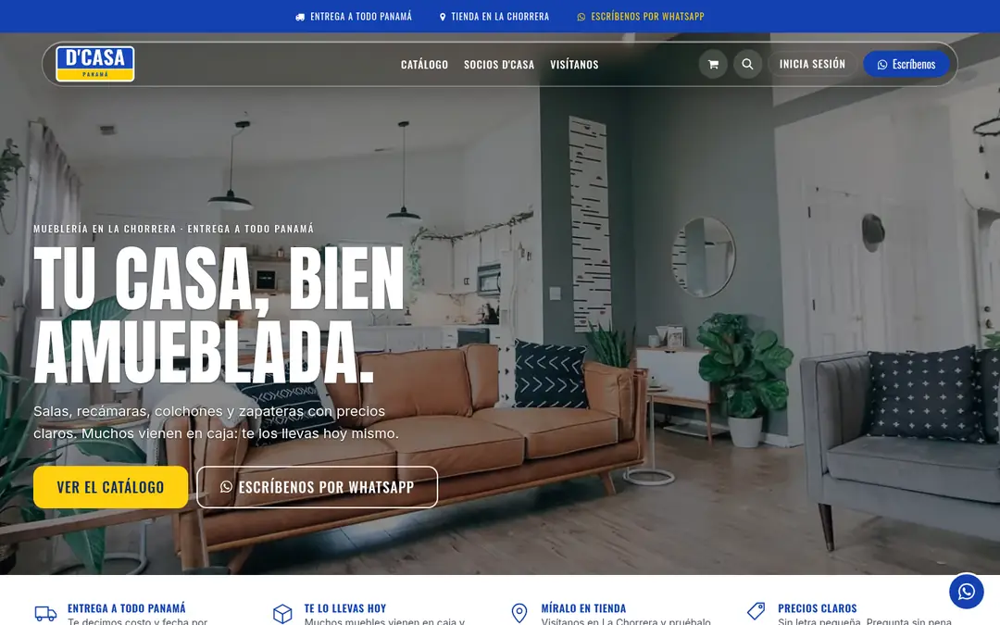
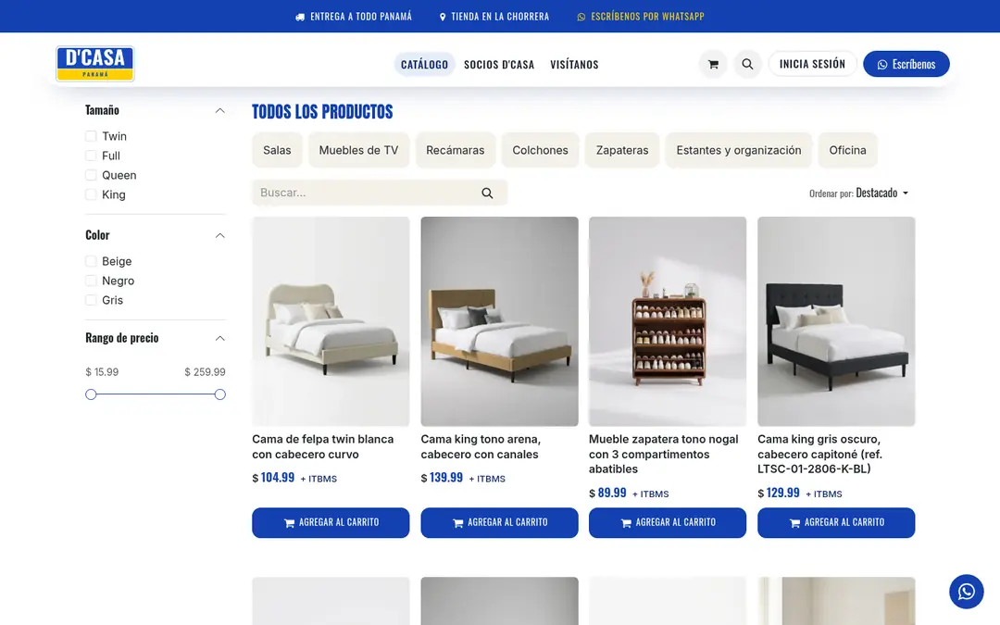
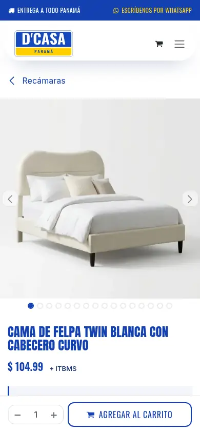
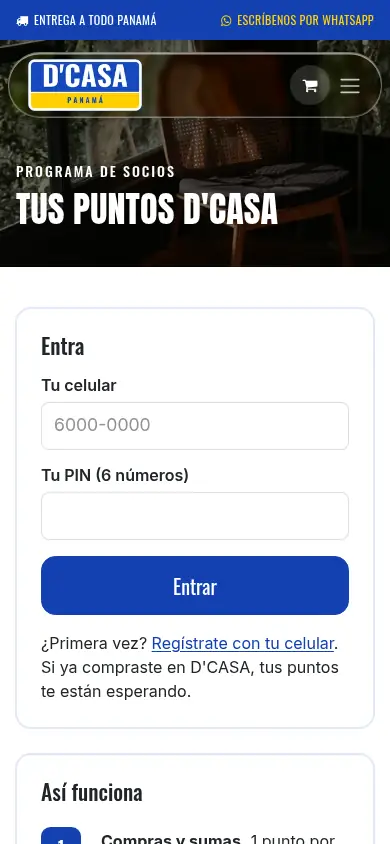
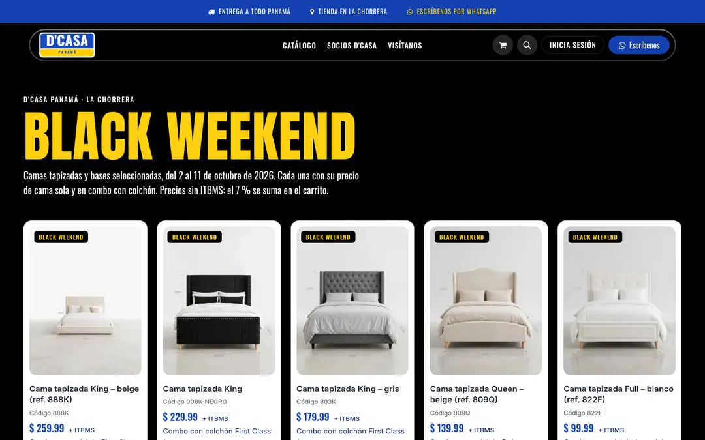

# Ronda 6 — Diseño del sitio: regresiones y pulido

Fecha: 2026-10-02. Alcance: `addons/website_dcasa` (Odoo 19). No se tocó `edge/` ni
`addons/dcasa_tienda_borde`.

> **Nota (v3, corrección de la dueña).** La placa navy de la portada y el «vidrio en tinta» de la
> píldora que describen §2, §5 y §6 **se revirtieron**: la dueña ya había decidido en la v2.1 que
> el texto va sobre la foto sin placa, y la píldora vuelve a ser el vidrio líquido original. Lo
> vigente está en **§8**; lo demás de esta ronda se conserva.

Pedido de la dueña: el sitio «se dañó mucho». Le gusta el estilo de **/socios** y la **píldora de
Odoo** (logo, CATÁLOGO · SOCIOS D'CASA · VISÍTANOS, carrito, búsqueda, cuenta y el botón azul
«Escríbenos») y lo quiere en todo el sitio. Se quejó de la foto del pie «azulosa», del velo que
lavaba la foto de la portada y de «muchas cosas dañadas».

Método: Odoo local con todos los módulos y el catálogo real (237 productos), capturas con
Playwright a 1440 y 390 px de 11 páginas, Lighthouse 12 móvil (3 corridas por página y modo,
mediana) detrás de un proxy con gzip (como Cloudflare), y `git log -p` de `website_dcasa`.
La base «antes» es una copia de la misma base con el código de `bf28cbd`.

## 1. Regresiones encontradas

| # | Qué se veía | Dónde | Origen |
|---|---|---|---|
| R1 | **Velo azul que lava las fotos** (portada y categorías) | Tienda estática del borde: `.hero{background:navy}` + `img{opacity:.55}` y `.cat img{opacity:.75}` sobre navy | `c7458c7` (Fase 2, `edge/src/tienda/estilo.ts`). Ya apagada; no se tocó |
| R2 | **Foto de la portada apagada**: en Odoo, foto al 45 % sobre negro. Con una foto clara (sala blanca) queda gris y sucia | `dcasa.scss` `.o_dcasa_hero_media img {opacity:.45}` | `40d435d` (v2.1, «hero oscuro») |
| R3 | **Píldora distinta según la página**: oscura sobre las fotos (/, /socios, /visitanos, contacto) y blanca con sombra en tienda, ficha, carrito, legales, cuenta y Black Weekend | `dcasa.scss` (vidrio claro por defecto) | `40d435d`/v2.2 (diseño), agravado por las páginas nuevas sin cabecera propia: `35ec12d` (legales), `fa78864` (Black Weekend) |
| R4 | **/black-weekend: franja blanca** entre la píldora clara y la banda negra | `black_weekend_templates.xml` sin «cabecera encima» | `fa78864` |
| R5 | **Fotos de producto como tiras angostas** con dos bandas grises: el catálogo es casi todo vertical (158 fotos 9:16, 112 3:4) y la tarjeta es 1:1 con `contain` (y en la portada además `multiply` + 8 % de relleno, que las agrisaba) | tarjetas de /shop, carriles de la portada, Black Weekend | `41fbb60` (v2) y `12b0c52` (tarjeta 1:1 con srcset) |
| R6 | **Legales con aspecto de borrador**: subtítulos en Anton en minúscula (Anton es solo para titulares en caja alta), sin cabecera, enlaces del texto sin subrayar (Lighthouse `link-in-text-block`) | `legal_templates.xml` | `35ec12d`, `c7458c7` |
| R7 | **Cuenta (/web/login)**: formulario suelto; Odoo lo pinta oculto y lo muestra con JavaScript → el pie salta ~500 px (**CLS 0,44** en móvil con red lenta) | plantilla de Odoo | Odoo 19 (sin reserva de alto) |
| R8 | **Logo de 56 KB** (PNG) en cada página con prioridad alta, compitiendo con la foto principal. Ya existía el WebP de 3-7 KB pero solo lo usaba el borde | `website.logo` | `c7458c7` creó el WebP sin usarlo en Odoo |
| R9 | **Barra de avisos en dos líneas en el celular** (70 px menos de foto) | `.o_dcasa_anuncios_inner` | v2 |
| R10 | **Filtro de refracción animado** sobre la foto: el `<animate>` del ruido repinta la píldora sin parar | `animaciones.js` | v2.3 |

Lo que **no** era regresión: las fuentes autoalojadas cargan bien (Anton, Oswald e Inter en todas
las páginas), el `<picture>` WebP de `/dcasa/img` no deforma nada (`display: contents`) y el pie de
Odoo **no tiene ninguna foto**: es azul sólido. La «foto azulosa» venía de la tienda del borde
(R1). Ahora un test lo fija (sin ``, `background-image`, `opacity` ni filtros en el pie).

## 2. Qué se corrigió

- **La píldora de /socios en todas las páginas** (R3) → *revertido el tinte en v3 (§8): la píldora es
  una sola en todo el sitio, pero con el vidrio líquido original.* Lo que se hizo aquí: siempre
  vidrio ahumado en tinta con texto y foco blancos, mismo logo, mismos enlaces, carrito, búsqueda,
  cuenta y «Escríbenos»:
  - sobre fondo claro casi opaca (tinta al 92 %: blanco ≈ 14:1);
  - sobre una foto o fondo oscuro, al 66 % (blanco ≥ 4,6:1 aun sobre blanco puro), sin el brillo
    extra del vidrio claro;
  - las páginas con «cabecera encima» nacen ya con la variante oscura (sin destello al cargar);
  - hamburguesa blanca en el celular.
- **Portada sin velo** (R2) → *revertido en v3 (§8): texto sobre la foto, sin placa, velo del 45 %.*
  Lo que se hizo aquí: la foto con sus colores reales (`opacity: 1`, sin filtro ni capa encima) y el
  contraste en una **placa navy plana** (blanco 13,6:1); en el celular, primero la foto y debajo la
  placa.
- **Cabeceras como la de /socios** para las páginas que no tenían (R4, R6, R7): plantilla
  `website_dcasa.cabecera_pagina` en privacidad, términos y cuenta; /black-weekend sube su banda
  negra bajo la píldora.
- **Fotos de producto 3:4 que llenan la tarjeta** (R5) en /shop, categorías, carriles de la
  portada y Black Weekend. A una 9:16 solo se le recorta aire de arriba y abajo (revisado sobre las
  fotos reales). Las anchas (muebles de TV, estantes con medidas) no se recortan: `animaciones.js`
  las marca `.o_dcasa_foto_ancha` y van enteras. El cuadro no cambia de tamaño: sin CLS.
- **Legales legibles** (R6): subtítulos en Oswald azul en caja alta (como /socios/terminos), cuerpo
  a 17 px / 1,7 y ≈ 70 caracteres por línea, enlaces subrayados.
- **Cuenta** (R7): formulario en la tarjeta de /socios y alto reservado: CLS ≈ 0.
- **Logo en WebP** (R8) mientras sea el de fábrica (se compara el `checksum` del adjunto con
  `dcasa_base/static/img/logo.png`); si la dueña sube otro desde el editor, se muestra el suyo.
- **Avisos en una línea** en el celular (R9).
- **Sin animación del filtro** (R10); la refracción queda solo en el vidrio. → *En v3 vuelve el flujo
  del vidrio (era parte del look): solo mientras la píldora está sobre la foto y nunca con
  `prefers-reduced-motion` (§8).*

## 3. Mejoras («a la excelencia», sin perder la identidad)

- Jerarquía: titulares Anton solo en caja alta; subtítulos Oswald; cuerpo Inter. Nombres de
  producto de /shop en Inter 600 (antes Oswald condensada, cansaba en dos líneas).
- Accesibilidad (Lighthouse 100 en portada, socios, privacidad, cuenta y Black Weekend; 98 en la ficha y 96 en /shop por marcado del núcleo):
  - «Agregar al carrito» de Black Weekend: el nombre accesible empieza por el texto visible
    (`label-content-name-mismatch`);
  - orden de titulares en /black-weekend (h1 → h2 → h3);
  - ficha: la cantidad tiene nombre («Cantidad») y teclado numérico;
  - cuenta: destino del «Saltar al contenido», botón del ojo con nombre, sin `tabindex="1"`.
- Rendimiento: logo 56 → 3-7 KB; precarga de la foto de la portada; fuera las precargas de
  FontAwesome e Inter (Anton sigue precargada: es el titular); «Compra por espacio» a 400 px en el
  celular; foto de /socios con versión de 480 px; foto principal de la ficha a tiempo y en WebP
  (`website_dcasa.ficha_foto_prioritaria`); sin repintado continuo de la píldora.
- Lo que queda de Odoo y no se tocó (núcleo): los radios de categorías sin `label` y
  `role="article"` en un `<form>` de /shop, el `h6` de atributos en la ficha.

## 4. Métricas antes / después

Lighthouse 12 móvil, mediana de 3, Odoo local con gzip delante, mismas bases de datos.
«Real» = estrangulamiento real de DevTools (4G lenta 1,6 Mb/s, RTT 150 ms, CPU 4×); «simulado» =
el modelo de Lighthouse por defecto.

**Estrangulamiento real (4G lenta + CPU 4×)**

| Página | LCP antes → después | CLS antes → después | Rend. antes → después | Accesib. antes → después | Peso antes → después |
|---|---|---|---|---|---|
| Portada | 3,40 s → **2,74 s** | 0,001 → 0,001 | 54 → 64 | 100 → 100 | 1 764 → 1 453 KB |
| /shop | 3,27 s → **2,68 s** | 0,006 → 0,009 | 59 → 68 | 96 → 96 | 1 215 → 1 114 KB |
| Ficha (con variantes) | 4,89 s → **2,96 s** | 0,004 → 0,005 | 51 → 67 | 95 → 98 | 1 200 → 1 097 KB |
| /black-weekend | 4,07 s → **3,29 s** | 0,021 → 0,027 | 55 → 66 | 98 → **100** | 1 198 → 1 129 KB |
| /socios | 3,44 s → **2,71 s** | 0,005 → 0,006 | 62 → 68 | 100 → 100 | 1 129 → 1 082 KB |
| /privacidad | 3,02 s → **2,59 s** | 0,001 → 0,007 | 69 → 70 | 96 → **100** | 1 076 → 1 065 KB |
| Cuenta (/web/login) | 3,00 s → **2,56 s** | **0,440 → 0,001** | 44 → 68 | 89 → **100** | 1 075 → 1 048 KB |

**Simulado (modelo por defecto de Lighthouse)**: el LCP queda en 7-9 s antes y después en casi
todas las páginas (una de las corridas de la portada dio 2,6 s). Lo explica el CSS y el
JavaScript de Odoo: el modelo cuenta antes de la foto todo lo que el navegador pidió hasta pintar,
y en este servidor eso incluye el paquete diferido de Odoo (583 KB gzip, ≈ 58 % sin usar en cada
página) y su CSS (136 KB gzip, ≈ 90 % sin usar). Bajar eso exige recortar paquetes del núcleo de
Odoo (fuera de esta ronda, propuesta en §5). En producción delante va Cloudflare (Brotli y la
caché del borde).

Playwright sin estrangular (1440 y 390 px, 11 páginas): CLS < 0,03 en todas (la cuenta pasó de
0,04-0,18 a 0,001), sin desborde horizontal y las tres fuentes cargadas en todas las páginas.

Qué movió el LCP: la precarga de la foto de la portada, el logo en WebP, quitar la precarga de
FontAwesome (76 KB, de Odoo) e Inter (36 KB) que competían con el CSS que bloquea el pintado, las
fotos de «Compra por espacio» a 400 px en el celular (−200 KB) y, en la ficha, la foto principal
pedida a tiempo (Odoo le ponía `loading="lazy"`: 2,1 s de espera) en WebP al ancho justo.

**Objetivo LCP < 2,5 s en 4G lenta: no se alcanza todavía** (2,56-3,29 s). Lo que falta es el
CSS de Odoo; ver §5.

## 5. Decisiones para la dueña

- **Placa navy en la portada.** → **Decidido por la dueña (v3): sin placa.** El texto va sobre la foto
  «un poco opaca»; ver §8 (velo del 45 % y halo en las letras para el AA).
- **Fotos de producto recortadas a 3:4.** Solo se recorta fondo de estudio; las fotos anchas van
  enteras. Si algún producto pierde algo importante, la foto se puede reemplazar por una 3:4.
- **Precarga de la foto de la portada**: si se cambia esa foto desde el editor, hay que apagar la
  vista «D'CASA: precarga de la foto de la portada» o actualizar sus rutas.
- **Siguiente paso de rendimiento (no hecho)**: el CSS de Odoo (136 KB gzip, 90 % sin usar) bloquea
  el primer pintado. Opciones: CSS crítico en línea para la cabecera y el hero, o sacar del paquete
  del sitio los módulos de Odoo que la tienda no usa. Es trabajo sobre el empaquetado del núcleo y
  conviene medirlo en staging con Cloudflare delante.

## 6. Tests

`addons/website_dcasa/tests/test_diseno.py`:
- la píldora (avisos, logo WebP, Catálogo · Socios D'CASA · Visítanos, carrito, búsqueda, cuenta y
  «Escríbenos») está en portada, tienda, categoría, ficha, carrito, Black Weekend, socios,
  visítanos, contacto, privacidad, términos y cuenta;
- las páginas con foto o fondo oscuro llevan la cabecera encima; tienda, ficha y carrito no;
- el pie no tiene fotos, fondos, opacidad ni filtros;
- con otro logo, se respeta el de la dueña;
- la foto de la portada se precarga (solo en la portada), sin precarga de FontAwesome, «Compra por
  espacio» con versión de 400 px y la foto de la ficha «eager», con prioridad alta y srcset;
- en Chrome (v3): la portada sin placa (bloque de texto transparente y superpuesto a la foto, también
  en un marco de 390 px), velo negro plano entre 35 y 45 %, sin filtro ni capa, texto blanco con halo
  y contraste medido sobre los píxeles reales (subtítulo ≥ 4,5:1, titular ≥ 3:1); el vidrio «fluye»
  donde hay refracción; la píldora es la líquida en /shop (clara, texto en tinta) y en /socios
  (ahumada, texto blanco); el pie sin imágenes ni filtros.

`test_seo_y_promesas.test_precarga_de_las_fuentes_del_primer_pantallazo` se actualizó: ahora
exige la precarga de Anton y que Inter y FontAwesome **no** se precarguen.

Corrida: `website_dcasa,dcasa_catalogo,dcasa_tienda_borde,dcasa_base` en base limpia y `ruff check addons`.

## 7. Capturas

En `capturas/` (WebP, ancho 1080 en escritorio). «Antes» es `bf28cbd`; «después», esta ronda.

| Página | Antes | Después |
|---|---|---|
| Portada, escritorio |  |  |
| Portada, celular |  |  |
| Tienda, escritorio |  |  |
| Tienda, celular |  |  |
| Ficha, celular |  |  |
| Black Weekend |  |  |
| Privacidad, celular |  |  |
| Cuenta |  |  |
| Pie (sin cambios: azul sólido, sin foto) |  |  |

## 8. Corrección de la dueña (v3)

La dueña vio la ronda 6 y señaló dos cosas que **ya había decidido antes** y que `38bb580` deshizo:

1. **El héroe de la portada no lleva placa.** En la v2.1 (`40d435d`) pidió «sin placa azul»: el texto
   va directamente **encima de la foto**, con la foto un poco oscurecida para que se lea. La placa navy
   (y, en el celular, la placa debajo de la foto) se quitó.
2. **La píldora perdió su efecto líquido.** El «vidrio en tinta» al 66 %/92 % con `saturate(140%)` y sin
   el movimiento del filtro no es la píldora que ella aprobó (v2.2/v2.3).

### Qué cambió

- **Portada**: vuelve el hero original (`.o_dcasa_hero`: foto a sangre sobre negro, texto blanco abajo a
  la izquierda, también en el celular). El velo es **negro plano del 45 %** (`$dcasa-hero-velo: .45` →
  `opacity: .55` en la foto): el tope del rango acordado (35-45 %), un poco menos que el 55 % de la
  v2.1 (que lavaba la sala blanca a gris) y lo más cerca de lo que ella ya vio bien. Las cabeceras de
  página (/socios, /visitanos, legales, cuenta) no cambian: siguen con su foto al 45 %, el estilo que
  le gusta.
- **Contraste AA sin placa**: la foto es una sala blanca y detrás del texto el percentil 90 de
  luminancia es 0,92: con un velo plano del 35-45 % (y también con el 55 % de la v2.1) el blanco no
  llega a AA sobre los puntos más claros (≈ 1,6-2,3:1). Sin placa, sin degradado y sin oscurecer más
  la foto, lo que garantiza el borde de contraste es un **halo oscuro y ajustado en las letras**
  (`text-shadow: 0 1px 2px rgba(0,0,0,.5), 0 0 1px rgba(0,0,0,.6)`, solo en kicker, titular y
  subtítulo de la portada): no es una sombra dramática y se quita en una línea si la dueña no lo
  quiere. Medido en Chrome (contraste del blanco contra la foto velada, píxeles reales detrás de cada
  texto, con la foto a 1400 px):

  | Texto | 1440 px: mediana · p90 · p99 | 390 px: mediana · p90 · p99 |
  |---|---|---|
  | Titular (Anton 104 px → AA grande 3:1) | 4,84 · 3,50 · 3,44 | 4,82 · 4,54 · 4,48 |
  | Subtítulo (Inter ≈ 20 px → 4,5:1) | 7,06 · 4,58 · 3,52 | 5,20 · 4,97 · 4,68 |
  | Kicker (Oswald 14 px → 4,5:1) | 4,98 · 4,01 · 3,49 | 4,91 · 4,74 · 4,67 |

  El titular pasa 3:1 hasta en el p99; el subtítulo y el kicker pasan 4,5:1 en la mediana y el p90
  (en el celular también en el p99) y el halo cubre el 1-10 % más claro.
- **Píldora**: restaurado el vidrio líquido de la v2.3 tal cual (`rgba(#FFF,.62)`,
  `blur(16px) saturate(210%) brightness(1.08)`, filos de luz, reflejo al pasar el puntero,
  `--dcasa-refraccion` con `url(#dcasa-liquido)` en Chromium) y su variante **ahumada** sobre la foto
  (`rgba(#000,.26)`, texto y foco blancos). Se conservan de la ronda 6: la misma píldora en todas las
  páginas (también legales, cuenta y Black Weekend, que ahora abren con foto o fondo oscuro y nacen
  ahumadas sin destello), la hamburguesa blanca sobre la foto, y en la tienda, la ficha y el carrito
  (fondo claro) el mismo vidrio va claro con el texto en tinta, como en la v2.3.
- **El vidrio «fluye»** (R10): el ruido del filtro vuelve a moverse (18 s). Era parte del look, pero el
  informe tenía razón en el costo: repintaba la píldora sin parar, incluso en páginas sin foto, donde
  sobre fondo liso no se ve. Ahora nace en pausa y solo corre mientras la píldora está sobre la foto;
  se pausa al bajar, con la pestaña oculta y nunca con `prefers-reduced-motion`.

### Qué se conserva de la ronda 6

La cabecera uniforme en legales y cuenta, /black-weekend con la banda bajo la píldora, fotos de
producto 3:4, el pie sin filtros, el logo WebP, las mejoras de accesibilidad y CLS, los avisos en una
línea y la hamburguesa visible.

### Tests

`test_diseno.py` fija lo nuevo (ver §6, último punto). Corrida: `website_dcasa,dcasa_catalogo` en base
limpia (`dcasa_t_hero`), 145 tests, y `ruff check addons` limpio. El test de navegador imprime las
medidas de velo y contraste en el log.

### Capturas v3

| Página | v3 |
|---|---|
| Portada, escritorio |  |
| Portada, celular |  |
| Tienda, escritorio (píldora líquida clara) |  |
| Ficha, celular |  |
| Socios, celular (píldora ahumada) |  |
| Black Weekend, escritorio |  |

### Si la dueña quiere ajustar

- Más o menos velo: `$dcasa-hero-velo` en `dcasa.scss` (0,35-0,45; el test lo fija en ese rango).
- Sin halo en las letras: quitar el `text-shadow` de `.o_dcasa_hero:not(.o_dcasa_hero_compacto)`; el
  test de contraste (mediana) seguiría pasando, pero el 1-10 % más claro de la foto quedaría bajo AA.
- Píldora ahumada también en la tienda: hoy el vidrio claro de la v2.3 sobre fondo claro es lo que da
  AA al texto en tinta; una píldora oscura sobre blanco exigiría otro tinte (lo que se probó en
  `38bb580` y ella rechazó).
